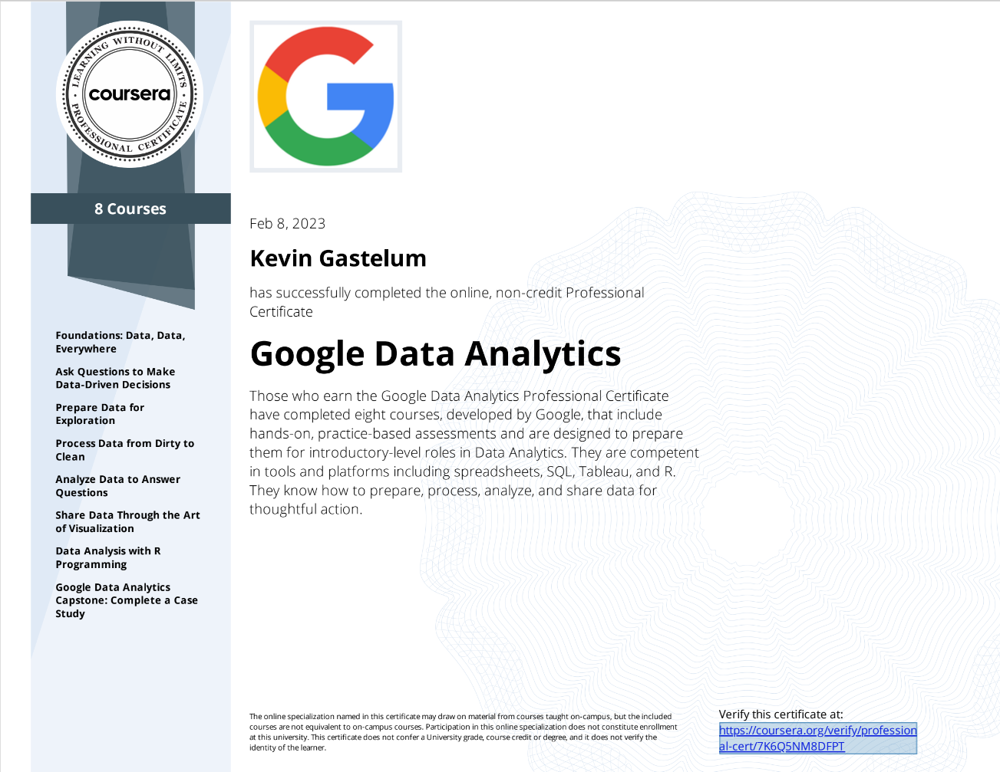
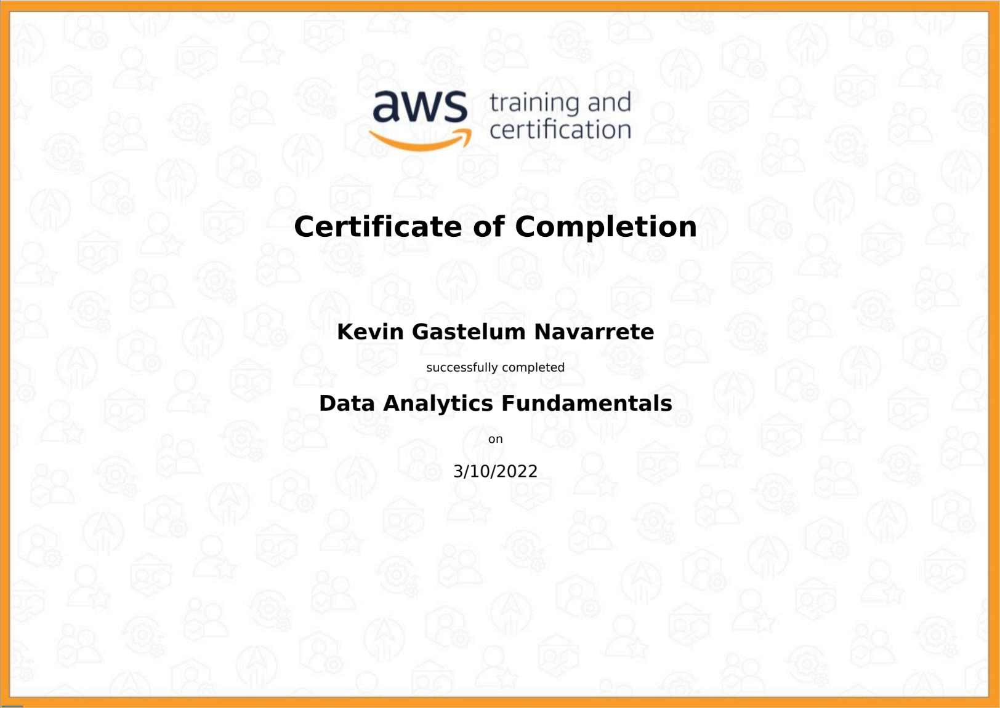

# [1. Google Data Analytics Professional Certificate](https://www.coursera.org/account/accomplishments/professional-cert/7K6Q5NM8DFPT)

# [2. FreeCodeCamp Data Analysis with Python](https://www.freecodecamp.org/learn/data-analysis-with-python/#data-analysis-with-python-course)
## Certification representing approximately 300hrs of coursework  (Work in Progress)

# [3. SQL Codecademy](https://www.codecademy.com/profiles/arc1643671602/certificates/042a4e5884e3eb6ea1f2a12be6abb851)

# [4. AWS Data Analytics Fundamentals](https://explore.skillbuilder.aws/learn/course/44/data-analytics-fundamentals)

