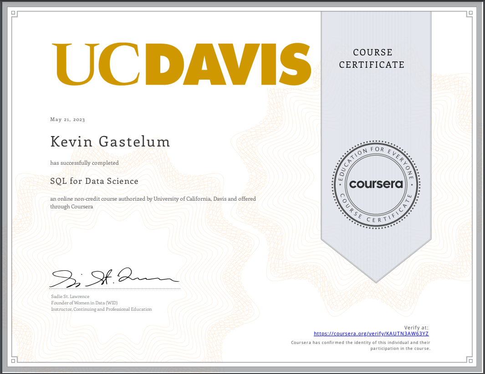
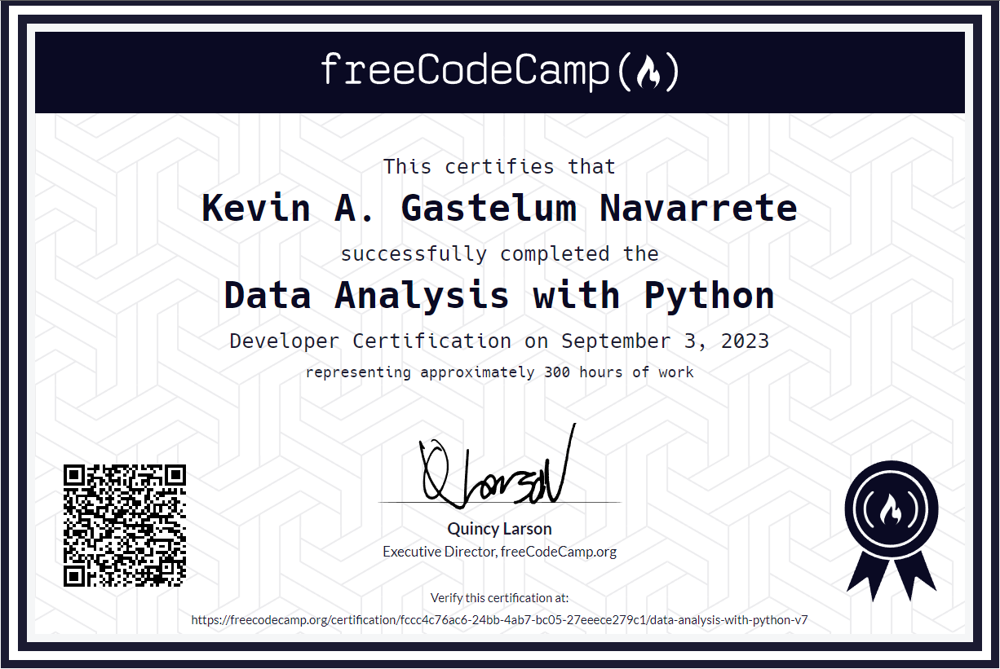

# [1. UC Davis - SQL for Data Science Certificate](https://www.coursera.org/account/accomplishments/verify/KAUTN3AW63YZ)

# [2. Google Data Analytics Professional Certificate](https://www.coursera.org/account/accomplishments/professional-cert/7K6Q5NM8DFPT)

# [3. FreeCodeCamp Data Analysis with Python](https://www.freecodecamp.org/certification/fccc4c76ac6-24bb-4ab7-bc05-27eeece279c1/data-analysis-with-python-v7)
## Certification representing approximately 300hrs of coursework  

# [4. SQL Codecademy](https://www.codecademy.com/profiles/arc1643671602/certificates/042a4e5884e3eb6ea1f2a12be6abb851)

# [5. AWS Data Analytics Fundamentals](https://explore.skillbuilder.aws/learn/course/44/data-analytics-fundamentals)

<!-- -->
<!-- -->
<!-- -->
<!-- -->
<!-- -->
<!-- -->
<!-- -->
<!-- -->
<!-- -->
<!-- -->
<!-- -->
<!-- -->
<!-- --><!-- -->
<!-- -->
<!-- -->
<!-- -->
<!-- -->
<!-- -->
<!-- -->
<!-- -->
<!-- -->
<!-- -->
<!-- -->
<!-- -->
<!-- -->
